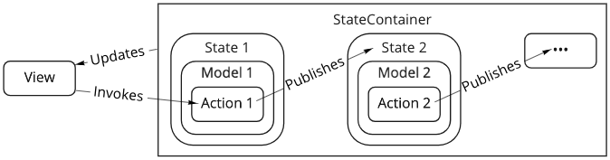

# VSM for iOS

VSM is a unidirectional, type-safe, behavior-driven, clean architecture. This repository hosts an open-source swift package framework for easily building features in VSM on iOS.

## Overview

VSM stands for View State Model. The View observes and renders the State. Each State may provide a Model. Each Model contains the Data and Actions available in the given State. Each Action in a Model returns one or more new States. State changes cause the View to update.

)

There are several options to help you get started

- Jump into the [Quickstart Guide](https://wayfair.github.io/vsm-ios/documentation/vsm/quickstartguide)
- Visit the [VSM Documentation](https://wayfair.github.io/vsm-ios/documentation/vsm/) for a complete framework reference and links to other learning resources
- Open the [Demo App](Demos/Shopping) to see many different working examples of how to build features using the VSM pattern

## Project Information

### Credits

VSM for iOS is owned and [maintained](MAINTAINERS.md) by [Wayfair](https://www.wayfair.com/).

### Contributing

See [CONTRIBUTING.md](CONTRIBUTING.md).

### Security

See [SECURITY.md](SECURITY.md).

### License

VSM for iOS is released under the MIT license. See [LICENSE](LICENSE) for details.
