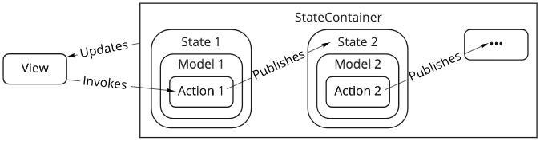

[](CHANGELOG.md)
[](https://github.com/wayfair/vsm-ios/actions/workflows/lint.yml)
[](https://github.com/wayfair/vsm-ios/actions/workflows/ci.yml)
[](CODE_OF_CONDUCT.md)
[](https://wayfair.github.io)

# VSM for Apple Platforms

VSM is a reactive architecture that is unidirectional, highly type-safe, behavior-driven, and clean. This repository hosts an open-source Swift package for building features in VSM on Apple platforms.

## Overview

VSM stands for both “View State Model” and “Viewable State Machine”. The first definition describes how a feature in VSM is structured; the second describes how information flows.



In VSM, the **View** renders the **State**. Each state may provide a **Model**. Each model contains the data and actions available in a given state. Each action in a model returns one or more new states. State changes update the view. **VSM** heavly leverages **Swift 6** and **structured concurrency** so model actions express multi-step flows with
* `StateSequence` and `@StateSequenceBuilder`
* `AsyncStream` or other `AsyncSequence` types
* `await` an asychronous function to return a state.

## Learning resources

- The [VSM documentation](https://wayfair.github.io/vsm-ios/documentation/vsm/) contains a complete framework reference, guides, and other learning resources.
- [Migrating from VSM 1.x (LegacyVSM) to VSM 2.0](https://wayfair.github.io/vsm-ios/documentation/vsm/migrationfromlegacyvsm) covers upgrading the dependency, the `LegacyVSM` bridge, `import`/`@ViewState` naming, moving from publishers to `StateSequence`/async, and UIKit notes (including `RenderedViewState` on older iOS versions).
- For **LegacyVSM**-only DocC content, open the documentation catalog under `Sources/LegacyVSM/Documentation.docc` in Xcode or browse that folder in the repo (hosted Pages focus on the modern module).
- Open the [Shopping (Swift 6) demo](Demos/Shopping%20(Swift%206)) (VSM 2.0) or [LegacyShopping demo](Demos/LegacyShopping) (VSM 1.x / LegacyVSM) to compare the same UI with the old and new styles.

## Package layout: VSM 2.0 vs LegacyVSM

This package ships **two libraries**:

| Product | Swift | Role |
|--------|--------|------|
| **`VSM`** | Swift 6 | Modern VSM: `@ViewState`, `AsyncStateContainer`, `StateSequence`, async observation APIs |
| **`LegacyVSM`** | Swift 5 | Compatibility: `@LegacyViewState`, Combine, publisher-based `$state.observe` |

If you still rely on **Combine** and the VSM 1.x pattern, use the **`LegacyVSM`** product (`import LegacyVSM`, `@LegacyViewState`) until you migrate. See [Package layout](#package-layout-vsm-20-vs-legacyvsm) and [Migrating from legacy VSM](#migrating-from-legacy-vsm). You can link **both** to the same app during migration: new or migrated screens use `VSM`; untouched screens stay on `LegacyVSM`. See the migration guide below for the recommended order of steps (bump the package → add `LegacyVSM` → rename imports/wrappers → migrate feature by feature).

## Code introduction (VSM 2.0)

The following excerpts sketch a small feature that loads a blog entry from a repository. Actions return `StateSequence` (and use `async` work inside) instead of Combine publishers.

### State definition

The state is usually an `enum` (or other type) representing the phases the view can be in.

```swift
enum BlogEntryViewState {
    case initialized(loaderModel: LoaderModel)
    case loading(errorModel: ErrorModel)
    case loaded(loadedModel: LoadedModel)
}
```

### Model definition

Models implement the business logic. Multi-step transitions use `@StateSequenceBuilder` and `StateSequence`; individual steps can be `async`.

```swift
struct BlogEntry: Decodable {
    let id: Int
    let title: String
    let body: String
}

struct LoadedModel {
    let title: String
    let body: String
}

struct ErrorModel {
    let repository: BlogEntryProviding
    let entryId: Int
    let message: String

    func retry() -> StateSequence<BlogEntryViewState> {
        LoaderModel(repository: repository, entryId: entryId).loadEntry()
    }
}

struct LoaderModel {
    let repository: BlogEntryProviding
    let entryId: Int

    @StateSequenceBuilder
    func loadEntry() -> StateSequence<BlogEntryViewState> {
        BlogEntryViewState.loading(errorModel: nil)
        Next { await self.fetchEntry() }
    }

    @concurrent
    private func fetchEntry() async -> BlogEntryViewState {
        do {
            let blogEntry = try await repository.loadEntry(entryId: entryId)
            let loadedModel = LoadedModel(title: blogEntry.title, body: blogEntry.body)
            return .loaded(loadedModel: loadedModel)
        } catch {
            let errorModel = ErrorModel(
                repository: repository,
                entryId: entryId,
                message: error.localizedDescription
            )
            return .loading(errorModel: errorModel)
        }
    }
}
```

### View definition

The view reads the current state from `@ViewState` and drives transitions with `$state.observe(...)`, passing async sequences (or other supported async types) returned by the model—not Combine publishers.

```swift
struct BlogEntryView: View {
    @ViewState var state: BlogEntryViewState

    var body: some View {
        switch state {
        case .initialized(loaderModel: let loaderModel):
            ProgressView()
                .onAppear {
                    $state.observe(loaderModel.loadEntry())
                }
        case .loading(errorModel: let errorModel):
            ZStack {
                ProgressView()
                if let errorModel = errorModel {
                    VStack {
                        Text(errorModel.message)
                        Button("Retry") {
                            $state.observe(errorModel.retry())
                        }
                    }
                }
            }
        case .loaded(loadedModel: let loadedModel):
            Text(loadedModel.title)
            Text(loadedModel.body)
        }
    }
}
```

_This example uses SwiftUI; the framework also supports UIKit via `@ViewState` (with the platform requirements noted in the docs) or `RenderedViewState` where appropriate._

For step-by-step tutorials and API details, see the [VSM documentation](https://wayfair.github.io/vsm-ios/documentation/vsm/).

## Migrating from legacy VSM

If your app was built on a single `import VSM` module with Combine and `@ViewState` observing publishers, **VSM 2.0** changes that split: the **async** framework is still `VSM`; the **Combine** path lives in **`LegacyVSM`** as `@LegacyViewState`.

Follow **[Migrating from VSM 1.x (LegacyVSM) to VSM 2.0](https://wayfair.github.io/vsm-ios/documentation/vsm/migrationfromlegacyvsm)** for:

- Bumping the package and adding the `LegacyVSM` product where needed  
- Replacing `import VSM` → `import LegacyVSM` and `@ViewState` → `@LegacyViewState` in files you have not migrated yet  
- Moving feature-by-feature to `import VSM`, `StateSequence`, and async `observe` overloads  

## Project information

### Credits

VSM for Apple platforms is owned and [maintained](MAINTAINERS.md) by [Wayfair](https://www.wayfair.com/).

### Contributing

See [CONTRIBUTING.md](CONTRIBUTING.md).

### Security

See [SECURITY.md](SECURITY.md).

### License

VSM for Apple platforms is released under the MIT license. See [LICENSE](LICENSE) for details.
